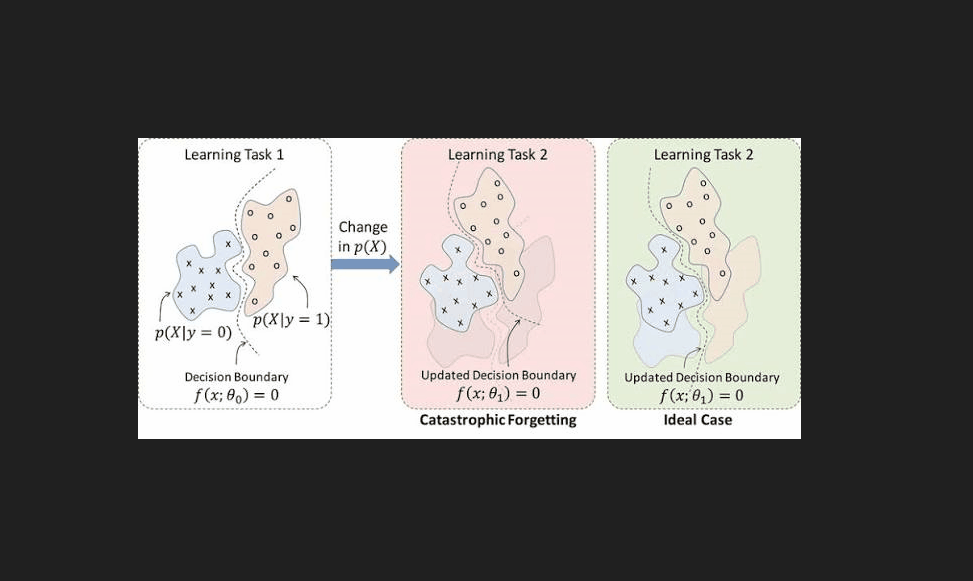

# SnipperAI

A little screen-capture tool for Windows that does more than just capture. Hit a hotkey, drag a box around anything on your screen, and either pull the text out of it (OCR), ask an AI to explain it, or just copy the image - all without leaving whatever you were doing.

It's the "snip, then actually do something with it" tool I wanted and couldn't quite find, so I built it.

## What it does

- **Snip anything** - global hotkey (`Ctrl+Shift+S` by default) drops a fullscreen overlay, drag to select an area
- **OCR** - extract text from the selection instantly, copy it with one click
- **Ask AI** - send the snippet to a vision-capable model and chat about it (follow-up questions included)
- **Copy image** - just grab the pixels, no fuss
- **Bring your own key** - SnipperAI doesn't run its own backend or see your data; you plug in your own OpenRouter API key and it talks directly to the model of your choice

## Getting started

Grab the latest build from [Releases](../../releases), unzip it, run `SnipperAI.exe`. First launch walks you through setup - you'll need an [OpenRouter](https://openrouter.ai) API key.

### Running from source

```bash
git clone https://github.com/HELLRAISER3/snipperai.git
cd snipperai
uv sync
uv run python -m main
```

## Using it

Press the hotkey, drag a selection box, and a small menu pops up next to it with your options. Settings (hotkey, API key, launch-on-startup) live behind the gear icon.

## Built with

PyQt6, RapidOCR, LangChain + OpenRouter for the AI side.
